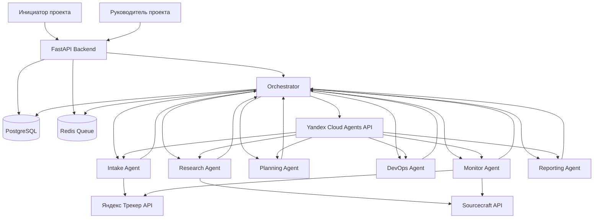

# Архитектура MVP платформы управления проектной деятельностью

## 1) Цель и фокус MVP

Платформа автоматизирует жизненный цикл проектной деятельности Центра технологий для Общества с помощью ИИ-агентов в Yandex Cloud.  
Приоритет MVP: `Intake Agent` + `Research Agent` + `Orchestrator`.

## 2) Схема взаимодействия агентов

## 3) Роли агентов (кратко)

- `Orchestrator` — единая точка координации, управление состоянием проекта, маршрутизация задач, эскалация человеку.
- `Intake Agent` — первичный приём заявок, оценка по 5 критериям, уточняющий диалог, формирование резюме.
- `Research Agent` — ресёрч источников, генерация и ранжирование гипотез, сбор структурированного аналитического отчёта.
- `Planning Agent` — построение роадмапа и требований к компетенциям, подготовка данных для комплектования команды.
- `DevOps Agent` — подготовка запросов на ресурсы Yandex Cloud и шаблонов инфраструктурных конфигураций.
- `Monitor Agent` — контроль прогресса в Трекере и Sourcecraft, обнаружение рисков, зависаний и блокеров.
- `Reporting Agent` — подготовка черновиков отчётов и материалов для публикации/анонсов.

## 4) Схема интеграций

Базовая цепочка интеграций:

1. `FastAPI` принимает событие (заявка, команда РП, webhook, cron-триггер).
2. `Orchestrator` выбирает агента и сценарий, создаёт задачу в очереди (`Redis`) и фиксирует состояние в `PostgreSQL`.
3. Агент вызывается через `Yandex Cloud Agents API` (модель + MCP-инструменты).
4. Агент обращается к внешним системам через интеграционные клиенты:
   - `Яндекс Трекер API` (задачи, комментарии, статусы),
   - `Sourcecraft API` (репозитории, активность, изменения),
   - `PostgreSQL` (состояние проекта, артефакты, логи),
   - при необходимости `Redis` (асинхронные задания и ретраи).
5. Результат возвращается в `Orchestrator`, сохраняется в БД и публикуется в целевую систему (например, в Трекер).

## 5) Поток данных между агентами

### Базовый pipeline MVP

1. **Intake**  
   Вход: заявка, данные инициатора, критерии оценки.  
   Выход: scorecard по 5 критериям, список вопросов, итоговое резюме.

2. **Orchestrator**  
   Нормализует результат Intake, обновляет статус проекта, запускает Research.

3. **Research**  
   Вход: резюме заявки, доменная область, цели проекта.  
   Выход: список источников, гипотезы с рейтингом, риски, рекомендации.

4. **Orchestrator**  
   Консолидирует артефакты, создаёт/обновляет задачу в Трекере, эскалирует РП при точках обязательного апрува.

### Сквозные принципы потока

- Все межагентные сообщения имеют `project_id`, `correlation_id`, `stage`, `payload`, `created_at`.
- Каждый шаг пишет аудит в `agent_logs` для трассировки решений.
- Любая операция из списка human-in-the-loop блокируется в статусе `awaiting_approval`.
